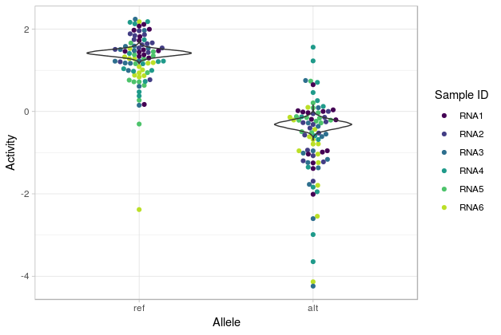

<!-- README.md is generated from README.Rmd. Please edit that file -->

```{r, echo = FALSE}
knitr::opts_chunk$set(
  collapse = TRUE,
  comment = "#>",
  fig.path = "README-"
)
```

# malacoda 

The goal of malacoda is to enable Bayesian analysis of high-throughput genomic assays like massively parallel reporter assays (MPRA) and CRISPR screens.

It uses a negative-binomial-based Bayesian model that offers numerous advantages over traditional null hypothesis significance testing based methods:  

* Models raw data - The model is fit directly to the input counts (MPRA barcodes or gRNAs)
    * The lack of transformations avoids discarding 0 counts as in traditional methods.
* Prior information - Empirical priors are fit from the observed assay globally, enabling estimate shrinkage that reduces errors due to multiple testing  
    * Informative annotations (such as DNase hypersensitivity estimates or gene scores) can be included to further refine the empirical priors by conditional density estimation.  
* The R interface provides clear and interpretable outputs and figures.

Other features include:  

* custom Stan models for fast posterior evaluation  
* variational Bayes support through `rstan::vb` that allows for quick first pass checks  
* Annotation checking - quantitatively evaluate how much a given genomic annotation source improves empirical prior estimation by prior ratios


## Installation

Currently `malacoda` only works on Mac and Linux. If you're a Windows user looking to use the software, open a Github issue, and we'll bump Windows support up the implementation  priority list.

The first step is to install `rstan`. The following command will usually suffice to do this, if not you can find more in-depth installation instructions [on the rstan documentation](https://github.com/stan-dev/rstan/wiki/Installing-RStan-on-Mac-or-Linux).

```{r gh-installation, eval=FALSE}
install.packages('rstan', dependencies = TRUE)
```

You can install malacoda from github with:

```{r eval = FALSE}
# install.packages("devtools")
devtools::install_github("andrewGhazi/malacoda")
```

## Example

This is a basic example which shows you how to fit the simplest form of the model:

```{r example, eval = FALSE}
library(malacoda)
marg_prior = fit_marg_prior(umpra_example)
fit_mpra_model(mpra_data = umpra_example,
               out_dir = '/path/to/outputs/',
               priors = marg_prior,
               n_cores = getOption('mc.cores', 2L),
               vb_pass = TRUE,
               save_nonfunctional = TRUE)
```

This will fit the model to each input in the assay (using some example variants from [Ulirsch et al., Cell, 2016](https://www.ncbi.nlm.nih.gov/pubmed/27259154)) using a marginal prior, save the outputs for each variant at the specified directory, and return a data frame of summary statistics for each variant, including binary calls of functional/non-functional, posterior means on activity levels & transcription shift.

|variant_id  | ts_post_mean| ref_post_mean| alt_post_mean|is_functional | hdi_lower| hdi_upper|
|:-----------|------------:|-------------:|-------------:|:-------------|---------:|---------:|
|3_141301451 |        1.482|        -0.516|         0.966|TRUE          |     1.180|     1.761|
|15_65882173 |       -1.133|        -2.489|        -3.623|FALSE         |    -2.434|     0.119|
|X_55054636  |       -1.094|         0.212|        -0.882|TRUE          |    -1.387|    -0.799|
|1_158620477 |        1.059|        -1.323|        -0.264|TRUE          |     0.461|     1.652|
|10_46003631 |       -0.886|        -2.299|        -3.185|FALSE         |    -2.137|     0.300|
|1_158497964 |       -0.798|        -0.178|        -0.976|TRUE          |    -1.371|    -0.222|

More sophisticated analyses that use annotations to create informative priors for higher sensitivity will be described in an upcoming vignette. The required functionality to do so currently exists with `fit_cond_prior`. Other features like annotation checking and traditional NHST analysis will also be explained in the vignette.

## Example output

In addition to the summary statistics table output above, the sampler outputs for each variant are saved in the user-defined output directory. These are stanfit objects, hence they can be visualized using all the tools provided in packages like [bayesplot](http://mc-stan.org/users/interfaces/bayesplot). 

`malacoda` also provides one plotting function of its own (with more planned), `posterior_beeswarm()`. This plots the traditional activity measurements as points in a beeswarm plot along with violins for posteriors on means for each allele. Optional colors can help diagnose unwanted sample-specific bias. That is, all the colors should be mixed within each allele, indicating that activity measurements are not influenced by sample.



## Upcoming Features

* Fleshed out CRISPR model support  
    * Time dependent depletion model
* Categorical conditional priors  
    * Estimate by-group conditional priors for non-continuous annotations (i.e. likely pathogenic vs benign vs VUS)

## Contact

Please contact me through Github DM or my BCM email address if you use the package or have feature requests / comments.
