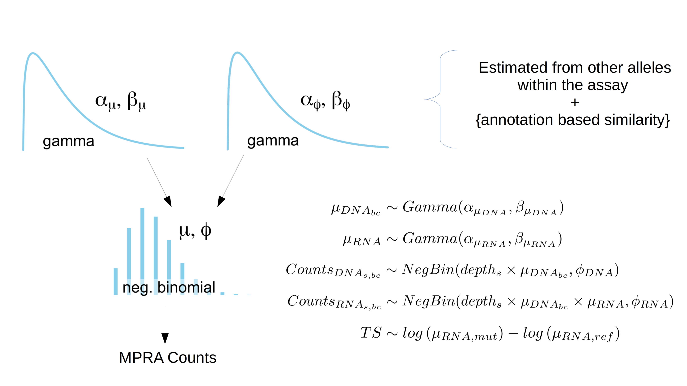

<!-- README.md is generated from README.Rmd. Please edit that file -->

# malacoda 

The goal of malacoda is to enable Bayesian analysis of high-throughput
genomic assays like massively parallel reporter assays (MPRA) and CRISPR
screens.

It uses a negative-binomial-based Bayesian model shown in the Kruschke
diagram below. This model offers numerous advantages over traditional
null hypothesis significance testing based methods:

  - Models raw data - The model is fit directly to the input counts
    (MPRA barcodes or gRNAs)
      - The lack of transformations avoids discarding 0 counts as in
        traditional methods.
  - Prior information - Empirical priors are fit from the observed assay
    globally, enabling estimate shrinkage that reduces errors due to
    multiple testing
      - Informative annotations (such as DNase hypersensitivity
        estimates or gene scores) can be included to further refine the
        empirical priors by conditional density estimation.  
  - The R interface provides clear and interpretable outputs and
    figures.

Other features include:

  - automated barcode counting from MPRA library design and FASTQs
  - custom Stan models for fast posterior evaluation  
  - variational Bayes support through `rstan::vb` that allows for quick
    first pass checks  
  - Annotation checking - quantitatively evaluate how much a given
    genomic annotation source improves empirical prior estimation by
    prior ratios
  - Convenience and QC functions - `count_barcodes()` to automatically
    go from FASTQs to raw MPRA counts. `get_sample_correlations()` to
    check the consistency of your data.



## Example

This is a basic example which shows you how to fit the simplest form of
the model. The input needs to provide the MPRA counts for each barcode
of each allele of each variant with a column for each sequencing sample.
This example only shows 8 rows, but realistic datasets will have
thousands.

| variant\_id       | allele | barcode      | DNA1 | DNA2 | RNA1 | RNA2 | RNA3 | RNA4 |
| :---------------- | :----- | :----------- | ---: | ---: | ---: | ---: | ---: | ---: |
| 1\_203652141\_2-3 | ref    | TTCGCGTCTCAG |   68 |   37 |  517 |  259 |  951 | 1525 |
| 1\_203652141\_2-3 | ref    | ACTTTCGATTTG |   11 |    7 |   75 |   43 |  104 |   96 |
| 1\_203652141\_2-3 | alt    | TCGCGCACGTAT |    6 |    2 |   49 |    9 |    7 |   29 |
| 1\_203652141\_2-3 | alt    | GAACGATCTATT |    5 |    7 |    3 |    0 |   58 |   12 |
| 1\_47682017\_1-3  | ref    | GCTGTTATCTTT |   29 |   22 |   23 |   11 |   35 |   20 |
| 1\_47682017\_1-3  | ref    | TAGTTTATCGCT |   29 |   25 |   15 |    6 |   92 |   14 |
| 1\_47682017\_1-3  | alt    | TGGTAGCATAAG |   50 |   34 |    8 |   27 |  185 |   38 |
| 1\_47682017\_1-3  | alt    | CACCTTAGAATG |   48 |   28 |   22 |    8 |    2 |    6 |

The specific format requirements for the input can be found on the help
page for `?fit_mpra_model`. The code below will fit the basic malacoda
model using a dataset that comes with the package:

``` r
library(malacoda)
marg_prior = fit_marg_prior(umpra_example)
fit_mpra_model(mpra_data = umpra_example,
               out_dir = '/path/to/outputs/',
               priors = marg_prior,
               n_cores = getOption('mc.cores', 2L),
               tot_samp = 1000,
               n_chains = 3,
               vb_pass = TRUE,
               save_nonfunctional = TRUE)
```

This will fit the model to each input in the assay (using some example
variants from [Ulirsch et al.,
Cell, 2016](https://www.ncbi.nlm.nih.gov/pubmed/27259154) in the
built-in dataset `umpra_example`) using a marginal prior, save the
outputs for each variant at the specified directory, and return a data
frame of summary statistics for each variant, including binary calls of
functional/non-functional, posterior means on activity levels &
transcription shift.

| variant\_id       | ts\_post\_mean | ref\_post\_mean | alt\_post\_mean | is\_functional | hdi\_lower | hdi\_upper |
| :---------------- | -------------: | --------------: | --------------: | :------------- | ---------: | ---------: |
| 1\_203652141\_2-3 |         \-1.73 |            3.91 |            2.17 | TRUE           |     \-2.03 |     \-1.47 |
| 4\_122791601\_2-3 |         \-1.70 |            4.04 |            2.34 | TRUE           |     \-2.00 |     \-1.45 |
| 17\_76382791\_1-2 |         \-1.70 |            4.04 |            2.34 | TRUE           |     \-2.01 |     \-1.42 |
| 11\_8923528\_1-2  |         \-1.59 |            3.79 |            2.20 | TRUE           |     \-1.88 |     \-1.31 |
| 17\_42305699\_1-3 |         \-1.58 |            3.88 |            2.30 | TRUE           |     \-1.85 |     \-1.27 |
| 15\_78536924\_1-2 |         \-1.58 |            3.81 |            2.23 | TRUE           |     \-1.88 |     \-1.32 |

More sophisticated analyses that use annotations to create informative
priors for higher sensitivity are described in the MPRA Analysis
vignette accessible with `vignette('mpra_vignette', package =
'malacoda')`. Other features like annotation checking and traditional
NHST analysis are also explained in the vignette. Each function provided
by the package have extensive help documentation that should help
elucidate what they do and how to use them e.g. `?fit_mpra_model`.

## Installation

`malacoda` is intended for use on Mac and Linux. Windows may work aside
from parallelization, however we do not intend to support Windows.

It’s best to have the most up-to-date version of R (3.6.0 as of May 2
2019).

The first step is to install `rstan` and `Rcpp`. The following command
will usually suffice to do this, if not you can find more in-depth
installation instructions [on the rstan
documentation](https://github.com/stan-dev/rstan/wiki/RStan-Getting-Started).
You should have root access.

``` r
# Sys.setenv(MAKEFLAGS = "-j4") # This compilation flag can help speed up
# installation on multi-threaded machines. This command uses 4 threads.
install.packages(c('Rcpp', 'rstan'), dependencies = TRUE, type = 'source')
```

Once malacoda is accepted up on CRAN it will be installable with:

``` r
# install.packages('malacoda')
```

You can install the development version of malacoda from github with:

``` r
# install.packages("devtools")
devtools::install_github("andrewGhazi/malacoda")
```

This should install the dependencies (which are mostly tidyverse
packages), compile the malacoda Stan models, and install the package.

`count_barcodes()` requires the
[FASTX-Toolkit](http://hannonlab.cshl.edu/fastx_toolkit/index.html)
(installation instructions provided at that link) and `sed` which comes
with most Unix-like operating systems. It can also optionally take
advantage of the [FreeBarcodes](https://github.com/hawkjo/freebarcodes)
package for barcode error-correction.

## Example output

In addition to the summary statistics table output above, the sampler
outputs for each variant are saved in the user-defined output directory.
These are stanfit objects, thus they can be visualized using all the
tools provided in packages like
[bayesplot](http://mc-stan.org/users/interfaces/bayesplot).

`malacoda` also provides several plotting function of its own, including
`posterior_beeswarm()`. This plots the traditional activity measurements
as points in a beeswarm plot along with violins for posteriors on means
for each allele. Optional colors can help diagnose unwanted
sample-specific bias. That is, all the colors should be mixed within
each allele, indicating that activity measurements are not influenced by
sample.


Other visualization functions are available for annotation checking.
These help visualize the improvement induced by the use of informative
conditional priors.

## Help

  - A full analysis walk-through is available through the mpra analysis
    vignette, accessible with `vignette("mpra_vignette")` (You will need
    to have built the vignette during package installation
    e.g. `devtools::install_github('andrewGhazi/malacoda',
    build_vignettes = TRUE)`)

  - Each function in the package has an associated help page that can be
    accessed from R, for example `?fit_mpra_model`. These are generally
    quite detailed.

  - You can see a list of the data objects included with the package
    using the command `data(package = 'malacoda')`. You can then access
    the description of each data object as you would the help
    documentation e.g. `?umpra_example` .

  - Don’t hesitate to open an issue on this Github repository or send me
    a direct message if things don’t work how you expect. Even if the
    package is working as intended, if users are having problems I want
    to fix that. \#\# Upcoming Features

  - ~~Fleshed out CRISPR model support~~ ✓
    
      - Informative prior estimation for CRISPR dropout screen models

  - ~~Categorical conditional priors~~ ✓

  - additional Quality Control functionality

  - monoallelic variant analysis
    
      - ~~model code~~ ✓
      - model interface

  - multi-tissue / multi-allelic variant analysis
    
      - ~~model code~~ ✓
      - model interface
      - tissue level informative prior estimation

## Contact

The massively parallel functionalization field is still rapidly changing
so there’s a lot of experimental structures out there that are not
accounted for in this package yet. If you’re interested in these
methods, feel free to contact me with some example data and I’ll be
happy to take a look to see if I can adapt the existing models\!

Please contact me through Github DM or my BCM email address if you use
the package or have feature requests / comments.
