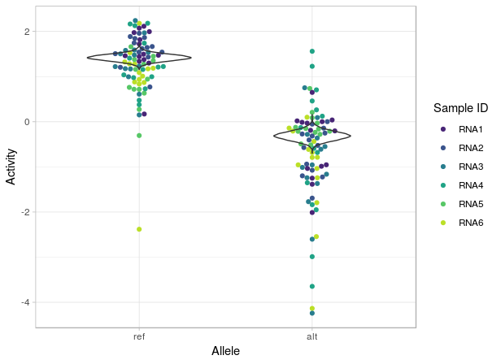

<!-- README.md is generated from README.Rmd. Please edit that file -->
malacoda 
==========================================================================

The goal of malacoda is to enable Bayesian analysis of high-throughput genomic assays like massively parallel reporter assays (MPRA) and CRISPR screens.

It uses a negative-binomial-based Bayesian model that offers numerous advantages over traditional null hypothesis significance testing based methods:

-   Models raw data - The model is fit directly to the input counts (MPRA barcodes or gRNAs)
    -   The lack of transformations avoids discarding 0 counts as in traditional methods.
-   Prior information - Empirical priors are fit from the observed assay globally, enabling estimate shrinkage that reduces errors due to multiple testing
    -   Informative annotations (such as DNase hypersensitivity estimates or gene scores) can be included to further refine the empirical priors by conditional density estimation.
-   The R interface provides clear and interpretable outputs and figures.

Other features include:

-   custom Stan models for fast posterior evaluation
-   variational Bayes support through `rstan::vb` that allows for quick first pass checks
-   Annotation checking - quantitatively evaluate how much a given genomic annotation source improves empirical prior estimation by prior ratios

Installation
------------

Currently `malacoda` only works on Mac and Linux. If you're a Windows user looking to use the software, open a Github issue, and we'll bump Windows support up the priority list.

The first step is to install `rstan`. This can usually be done with:

``` r
install.packages('rstan', dependencies = TRUE)
```

You can install malacoda from github with:

``` r
# install.packages("devtools")
devtools::install_github("andrewGhazi/malacoda")
```

Example
-------

This is a basic example which shows you how to fit the simplest form of the model:

``` r
library(malacoda)
marg_prior = fit_marg_prior(umpra_example)
fit_mpra_model(mpra_data = umpra_example,
               out_dir = '/path/to/outputs/',
               priors = marg_prior,
               n_cores = getOption('mc.cores', 2L),
               vb_pass = TRUE,
               save_nonfunctional = TRUE)
```

This will fit the model to each input in the assay (using some example variants from [Ulirsch et al., Cell, 2016](https://www.ncbi.nlm.nih.gov/pubmed/27259154)) using a marginal prior, save the outputs for each variant at the specified directory, and return a data frame of summary statistics for each variant, including binary calls of functional/non-functional, posterior means on activity levels & transcription shift.

<table style="width:100%;">
<colgroup>
<col width="13%" />
<col width="14%" />
<col width="15%" />
<col width="15%" />
<col width="15%" />
<col width="11%" />
<col width="11%" />
</colgroup>
<thead>
<tr class="header">
<th align="left">variant_id</th>
<th align="right">ts_post_mean</th>
<th align="right">ref_post_mean</th>
<th align="right">alt_post_mean</th>
<th align="left">is_functional</th>
<th align="right">hdi_lower</th>
<th align="right">hdi_upper</th>
</tr>
</thead>
<tbody>
<tr class="odd">
<td align="left">3_141301451</td>
<td align="right">1.482</td>
<td align="right">-0.516</td>
<td align="right">0.966</td>
<td align="left">TRUE</td>
<td align="right">1.180</td>
<td align="right">1.761</td>
</tr>
<tr class="even">
<td align="left">15_65882173</td>
<td align="right">-1.133</td>
<td align="right">-2.489</td>
<td align="right">-3.623</td>
<td align="left">FALSE</td>
<td align="right">-2.434</td>
<td align="right">0.119</td>
</tr>
<tr class="odd">
<td align="left">X_55054636</td>
<td align="right">-1.094</td>
<td align="right">0.212</td>
<td align="right">-0.882</td>
<td align="left">TRUE</td>
<td align="right">-1.387</td>
<td align="right">-0.799</td>
</tr>
<tr class="even">
<td align="left">1_158620477</td>
<td align="right">1.059</td>
<td align="right">-1.323</td>
<td align="right">-0.264</td>
<td align="left">TRUE</td>
<td align="right">0.461</td>
<td align="right">1.652</td>
</tr>
<tr class="odd">
<td align="left">10_46003631</td>
<td align="right">-0.886</td>
<td align="right">-2.299</td>
<td align="right">-3.185</td>
<td align="left">FALSE</td>
<td align="right">-2.137</td>
<td align="right">0.300</td>
</tr>
<tr class="even">
<td align="left">1_158497964</td>
<td align="right">-0.798</td>
<td align="right">-0.178</td>
<td align="right">-0.976</td>
<td align="left">TRUE</td>
<td align="right">-1.371</td>
<td align="right">-0.222</td>
</tr>
</tbody>
</table>

More sophisticated analyses that use annotations to create informative priors for higher sensitivity will be described in an upcoming vignette. The required functionality to do so currently exists with `fit_cond_prior`. Other features like annotation checking and traditional NHST analysis will also be explained in the vignette.

Example output
--------------

In addition to the summary statistics table output above, the sampler outputs for each variant are saved in the provided output directory. These are stanfit objects, hence they can be visualized using all the tools provided in packages like [bayesplot](http://mc-stan.org/users/interfaces/bayesplot).

`malacoda` also provides one plotting function of its own (with more planned), `posterior_beeswarm()`. This plots the traditional activity measurements as points in a beeswarm plot along with violins for posteriors on means for each allele. Optional colors can help diagnose unwanted sample-specific bias. That is, all the colors should be mixed within each allele, indicating that activity measurements are not influenced by sample.



Contact
-------

Please contact me through Github DM or my BCM email address if you use the package or have feature requests / comments.
