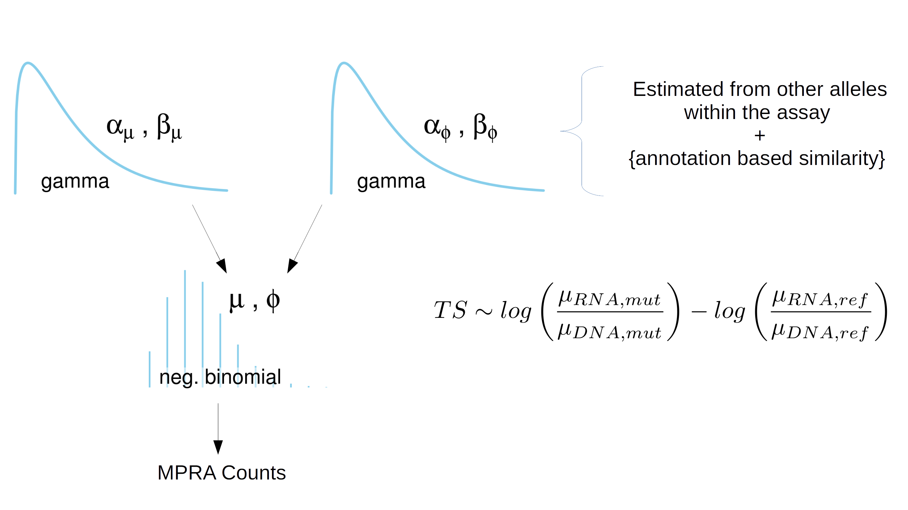

```{r setup, include = FALSE}
knitr::opts_chunk$set(
  collapse = TRUE,
  comment = "#>"
)
```

```{r}
library(tidyverse)
```


This vignette presents the MPRA analysis functions present in malacoda. These features include: 

* Bayesian negative binomial modelling of MPRA count data
* Integrating prior information sources into informative priors
* MPRA Quality control

# High-Throughput sequencing assay Negative Binomial model

This package provides a fully Bayesian model for count data coming from high-throughput, NGS-based assays. Massively parallel reporter assays (MPRA) are the motivating use-case, but methods are also provided for other assays with similar experimental structure/outputs.

The data outputs from a MPRA can be laid out simply in a data frame as shown below, with columns showing variant ID's, allele indicators, barcode sequence, and sequencing samples. A row for each barcode gives the number of times the given barcode was counted in each sequencing sample.

```{r}
load('../data/umpra_example.RData') 

umpra_example %>% 
  select_all(~gsub('K562_', '', .)) %>% 
  group_by(variant_id, allele) %>% 
  do(head(., 3)) %>% 
  .[1:12,] %>% 
  knitr::kable()
```

The software included in this software models the counts in each cell of this data frame as coming from a negative binomial distribution. The mean parameter of the negative binomial is first scaled according to sequencing depth. For counts from RNA samples, the mean parameter is also scaled according to the mean of the barcode's DNA input distribution. The remaining variability of the mean parameter for the RNA counts is ascribed to the allele associated with the barcode.

Essentially, each count measurement has it's own negative binomial distribution, but information is shared across measurements of the same barcode in different samples and across different barcodes measured in the same sample.

The priors for the parameters negative binomial distribution are gamma distributions. These are estimated from the MPRA assay globally, across different variants. This ensures that the priors for one allele are on a reasonable scale in the context of one experiment; the user doesn't need to know on th


```{r, out.width= "600px"}

```


Vignettes are long form documentation commonly included in packages. Because they are part of the distribution of the package, they need to be as compact as possible. The `html_vignette` output type provides a custom style sheet (and tweaks some options) to ensure that the resulting html is as small as possible. The `html_vignette` format:

- Never uses retina figures
- Has a smaller default figure size
- Uses a custom CSS stylesheet instead of the default Twitter Bootstrap style

## Vignette Info

Note the various macros within the `vignette` section of the metadata block above. These are required in order to instruct R how to build the vignette. Note that you should change the `title` field and the `\VignetteIndexEntry` to match the title of your vignette.

## Styles

The `html_vignette` template includes a basic CSS theme. To override this theme you can specify your own CSS in the document metadata as follows:

    output: 
      rmarkdown::html_vignette:
        css: mystyles.css

## Figures

The figure sizes have been customised so that you can easily put two images side-by-side. 

```{r, fig.show='hold'}
plot(1:10)
plot(10:1)
```

You can enable figure captions by `fig_caption: yes` in YAML:

    output:
      rmarkdown::html_vignette:
        fig_caption: yes

Then you can use the chunk option `fig.cap = "Your figure caption."` in **knitr**.

## More Examples

You can write math expressions, e.g. $Y = X\beta + \epsilon$, footnotes^[A footnote here.], and tables, e.g. using `knitr::kable()`.

```{r, echo=FALSE, results='asis'}
knitr::kable(head(mtcars, 10))
```

Also a quote using `>`:

> "He who gives up [code] safety for [code] speed deserves neither."
([via](https://twitter.com/hadleywickham/status/504368538874703872))
