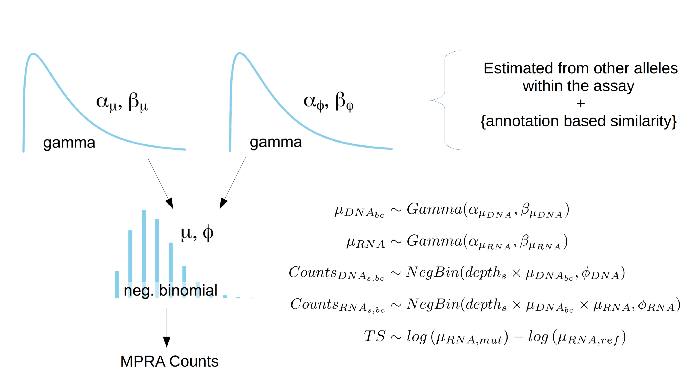

```{r setup, include = FALSE}
knitr::opts_chunk$set(
  collapse = TRUE,
  comment = "#>",
  echo = FALSE
)
```

```{r, message = FALSE}
library(dplyr)
library(purrr)
library(tidyr)
```


This vignette presents the MPRA analysis functions present in malacoda. These features include: 

* Bayesian negative binomial modelling of MPRA count data
* Integrating prior information sources into informative priors
* MPRA Quality control

# malacoda Installation

Currently `malacoda` only runs on Mac and Linux. If you're a Windows user looking to use the software, open a Github issue, and we'll bump Windows support up the implementation  priority list.

The first step is to install `rstan` and `Rcpp`. The following command will usually suffice to do this, if not you can find more in-depth installation instructions [on the rstan documentation](https://github.com/stan-dev/rstan/wiki/Installing-RStan-on-Mac-or-Linux).

```{r gh-installation, eval=FALSE, echo = TRUE}
install.packages(c('Rcpp', 'rstan'), dependencies = TRUE, type = 'source')
```

Once on CRAN, malacoda will be installable with:

```{r eval = FALSE, echo = TRUE}
install.packages('malacoda')
```

This should install the dependencies (mainly a lot of tidyverse packages), compile the malacoda Stan models, and install the package.

You can install the development version of malacoda from github with:

```{r eval = FALSE, echo = TRUE}
# install.packages("devtools")
devtools::install_github("andrewGhazi/malacoda")
```


# High-throughput sequencing assay Negative Binomial model

This package provides a fully Bayesian model for count data coming from high-throughput, NGS-based assays. Massively parallel reporter assays (MPRA) are the motivating use-case, but methods are also provided for other assays with similar experimental structure/outputs.

The data outputs from a MPRA can be laid out simply in a data frame as shown below, with columns showing variant ID's, allele indicators, barcode sequence, and sequencing samples. A row for each barcode gives the number of times the given barcode was counted in each sequencing sample. The table below shows some example data from [Ulirsch et al., Cell 2016](https://www.ncbi.nlm.nih.gov/pubmed/27259154) that is included with the package as the data object `umpra_example`:

```{r, echo = FALSE}
load('../data/umpra_example.RData') 

umpra_example %>% 
  select_all(~gsub('K562_|CTRL_', '', .)) %>% 
  group_by(variant_id, allele) %>% 
  do(head(., 3)) %>% 
  .[1:12,1:8] %>% 
  knitr::kable()
```

MPRA assays typically have 10 to 100 barcodes per allele for dozens to tens of thousands of variants.

The software included in this software models the counts in each cell of this data frame as coming from a negative binomial distribution. The mean parameter of the negative binomial is first scaled according to sequencing depth. For counts from RNA samples, the mean parameter is also scaled according to the mean of the barcode's DNA input distribution. The remaining variability of the mean parameter for the RNA counts is ascribed to the allele associated with the barcode. The Kruschke diagram below illustrates the model structure graphically:

```{r, out.width= "700px"}

```

The formulas on the right show the parts of the model relevant to computing the posterior on the **Transcription Shift**, TS. The index *s* refers to samples, and index *bc* refers to barcodes of a given allele.

Essentially, each count measurement has it's own negative binomial distribution, but information is shared across samples and barcodes.

# Prior estimation

The package provides methods for estimating two types of priors: marginal and conditional.

## Marginal priors  

The priors for the parameters negative binomial distribution are gamma distributions. These are estimated from the maximum likelihood estimates of means/dispersions observed in the MPRA assay globally, across all variants. This ensures that the priors for one allele are on a reasonable scale in the context of one experiment; the user doesn't need to know on *a priori* how to set these distributions.

In malacoda, this is done with `fit_marg_prior()` like so:

```{r, eval = FALSE, echo = TRUE}
marg_prior = fit_marg_prior(mpra_data,
                            rep_cutoff = .15,
                            plot_rep_cutoff = TRUE,
                            n_cores = 1)
```

This prior fitting includes a pre-filtering step that involves identifying which barcodes are sufficiently well-represented in the DNA samples. It also renders a plot of the DNA barcode representation with the input representation cutoff (defaulting to the 15th percentile) indicated by a dotted line. Users can/should tune this cutoff according to their assay with `get_sample_depths()` `get_well_represented()`.

For a typical MPRA assay where a majority of variants assayed have practically 0 effect on transcription shift, the marginal prior ends up being fairly non-informative. For both alleles, most of the prior density ends up around the average output of the assay, but the prior ascribes a small amount of density to extreme values. 

## Conditional priors

The marginal prior is relatively un-informative. `malacoda` provides methods for conditional density estimation on informative genomic annotations as a means to increase statistical efficiency while avoiding false positives.

This example (included with the package as `u_deepsea` shows [DeepSea's](deepsea.princeton.edu) predicted K562 DNase hypersensitivity for the variants in Ulirsch, 2016:

```{r}
load('../data/u_deepsea.RData')

u_deepsea %>% 
  head %>% 
  knitr::kable()
```

While this example shows only a single annotation, the methods included with this package can utilize an arbitrary number of annotations. A user could also include ENCODE transcription factor binding profiles, additional DeepSea predictions, etc. Whatever set of continuous annotations they think can provide information about their MPRA assay's results.

The function `fit_cond_prior` estimates conditional priors for each variant with these annotations. It does this in the following way:  

1. Normalize the scale of the annotations.  
2. Compute a pairwise distance matrix between the assay's variants in euclidean "annotation space".  
3. Take the minimum non-zero distance as the initial minimal weighting kernel width.  
4. For each variant,  
    1. Assign a weight to all other variants in the assay according to a t-distribution kernel characterized by the initial weight.  
    2. If fewer than 30 variants don't meaningfully contribute to the prior, increase the kernel width by 1.3x and re-set the weights. (The 30 and 1.3x are adjustable tuning parameters but these default settings work well in practice).  
5. Perform weighted density estimation for each variant to get the priors.  

This function can be called like so:

```{r, eval = FALSE, echo = TRUE}
cond_prior = fit_cond_prior(mpra_data = umpra_example,
                            annotations = example_deepsea,
                            n_cores = 1,
                            rep_cutoff = .15, 
                            plot_rep_cutoff = TRUE,
                            min_neighbors = 30)

```

This process gets better the more variants are included in the analysis. The more variants included, the more finely the annotation space is explored and the more precisely the nearest variants will give clear indication of the prior belief. Tuning `min_neighbors` provides a bias-variance tradeoff; decreasing it will increase the most proximal neighbors, but increase the variance of the prior estimation process. Increasing `min_neighbors` will make the conditional prior estimation more stable, but as `min_neighbors` grows the conditional prior becomes less informative and gradually approaches the marginal.

There are only 100 variants included with the example data for the sake of keeping the size of the package small, however published MPRA's have tested tens of thousands of variants ([Tewhey et al., Cell, 2016](https://www.ncbi.nlm.nih.gov/pubmed/27259153)). 

# Fitting the model

The model can be fit with a call to `fit_mpra_model()`:

```{r, eval = FALSE, echo = TRUE}
example_result = fit_mpra_model(mpra_data, 
                                out_dir = '/path/to/output/directory/',
                                priors = cond_prior, # or = marg_prior
                                n_cores = 1)
```

This will:  

1. Run a variational Stan model that fits the model described above for each variant. 
2. If the variational result looks promising, it will run the standard Stan MCMC sampler on the model.
3. Save the stanfit object for the variant as `<variant_id>.RData` in the output directory.
4. Compute some summary statistics for each variant, including a 99% transcription shift highest density interval and (based on that) a binary call for variant function (the `is_functional` column).
5. Compile the results into a data frame.
```{r}
load('../data/example_result.RData')

example_result %>% 
  select(-note, -ts_rope_mass) %>% 
  head %>% 
  knitr::kable(col.names = c('variant_id', 'TS Posterior Mean', 'Ref Activity', 'Alt Activity', 'is_functional', 'HDI lower', 'HDI upper'))
```

Filtering the result table like so will give the set of hits from the analysis:


```{r, echo = TRUE}
 example_result %>% 
  dplyr::filter(is_functional) %>% 
  select(-note, -ts_rope_mass) %>% 
  head %>% 
  knitr::kable(col.names = c('variant_id', 'TS Posterior Mean', 'Ref Activity', 'Alt Activity', 'is_functional', 'HDI lower', 'HDI upper'))
```


The MCMC parameters are adjustable (see `?fit_mpra_model`). 

A region of practical equivalence (ROPE) parameter `ts_rope` can be set to receive p-value-esque output in order to get some sense of how the result compares to a "null" model. Defining a ROPE requires experiment-specific statistical knowledge, so we won't provide any specific advice or examples on how to set this parameter in order to avoid misleading users. Proper use would need to involve analysis of the assay's noise and reasoned justification of the user's definition of "practically equivalent" to 0. Statisticians seeking to use this feature can find more information on ROPE's in *Doing Bayesian Data Analysis: A Tutorial with R, JAGS, and Stan* by John Kruschke.

# Traditional Analysis  

The package also provides functions for traditional t-test based analyses. See `?compute_activities` and `?run_activity_tests`. These functions compute the "Activity", $log(mRNA/DNA)$, after depth-correction for each count measurement. A simple t-test can be used to assess the statistical significance of the difference in mean activity. This method has several disadvantages: 

* Transforming the data - derived quantities lose statistical efficiency by neglecting the statistical properties generating the data
* Discarding data - the logarithm used to compute activity measurements can't handle a 0 in either the numerator or denominator. These data points must be discarded.  
* Multiple comparisons - In order to call identify variants as "functional", the test results must be adjusted to account for multiple testing using statistically burdensome transformations like the Bonferroni correction (the malacoda method side steps this issue through the estimate shrinkage effect of the prior distribution).

Additional details on the statistical properties of these methods can be found in the supplement of [Ghazi et al., Bioinformatics, 2018](https://doi.org/10.1093/bioinformatics/bty150). They work, but not amazingly well.

# Output visualization 

The stanfit objects output by the MCMC sampler in `fit_mpra_model` are written to the user-supplied output directory. This makes them amenable for use with all of the plotting functions in packages like [bayesplot](https://cran.r-project.org/web/packages/bayesplot/index.html).

malacoda also provides a number of plotting functions for visualizing the outputs.

## Posterior beeswarms

Posterior beeswarms via `posterior_beeswarm` overlay the activity point estimates (log(RNA/DNA) by barcode and sequencing sample from `compute_activities`) with the posteriors on mean activity (from `fit_mpra_model`). Setting `color_by_sample = TRUE` results in a very colorful plot that makes it easy to see if the posterior aligns with the point estimates and to ensure that none of the samples vary systematically.

```{r, out.width= "700px"}
knitr::include_graphics('../man/figures/posterior_beeswarm_example.png')
```

## Conditional prior visualization

It's natural to ask how much the conditional prior improves inference over the marginal prior. One metric to get at this is the "prior ratio": for a given parameter, we compute the density of the maximum likelihood estimate under the conditional relative to the density under the marginal. 

```{r, out.width= "700px"}
knitr::include_graphics(path = '../man/figures/cond_hexs.png')
```

It's worth noting that the fraction of estimates above the dotted line will not approach 1 with increasingly informative annotations. The maximum likelihood estimates are themselves noisy, so we *a priori* expect that sometimes the estimate will be wrong in the direction favored by the marginal prior. Increasingly better annotation sources will instead make the fraction above the line approach some hard-to-define limit imposed by the noise in the assay.

The example below shows a similar plot with a conditional prior trained on random noise. As can be seen, the points are NOT systematically above the dotted line.

```{r, out.width= "700px"}
knitr::include_graphics(path = '../man/figures/noise_hexs.png')
```

## Sample correlations

A simple QC visualization, this plot shows the pairwise count correlations of barcodes across the different samples. RNA samples should correlate highly with RNA samples, and DNA with DNA. However if RNA samples correlate highly with DNA samples, that can indicate DNA contamination of the RNA samples.

```{r, out.width= "700px"}
knitr::include_graphics(path = '../man/figures/mpra_corr.png')
```

# CRISPR analysis

The model structure shown in the Kruschke diagram works for NGS assays beyond MPRA. In an allelic CRISPR assay, where guide RNAs selectively cut / modify genomic material by allele, an analogous model also works. By changing the column names of a properly formatted CRISPR data frame, the same model can work with CRISPR data if the experimental structure is analogous to MPRA. 

## Condition/Control model

We have developed a modified model for CRISPR screens where gRNAs from an initial pool are modeled as becoming depleted or enriched by experimental conditions as compared to a control condition. The interface for this model is still under development, but the model itself is located in `/malacoda/src/stan_files/crispr_model.stan`. 

# Future directions 

## Improved CRISPR support

We are devloping improved support for CRISPR-focused methods with different experimental structures.

## Optimization 

The conditional prior fitting process involves optimizing multiple gamma distributions for potentially thousands of weighted points thousands of times, so it can take a long time on laptops for large MPRA's -- upwards of a minute per variant. However with parallelization and an Amazon EC2 instance with a large number of cores, it's possible to analyze the full Ulirsch, 2016 dataset in around 20 minutes for about $1. 

